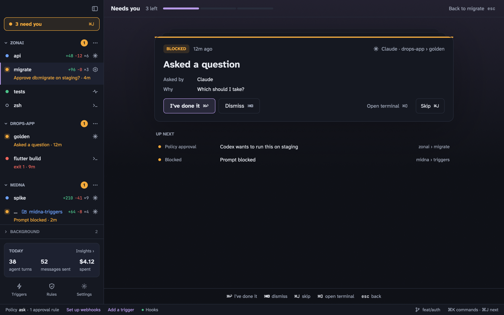
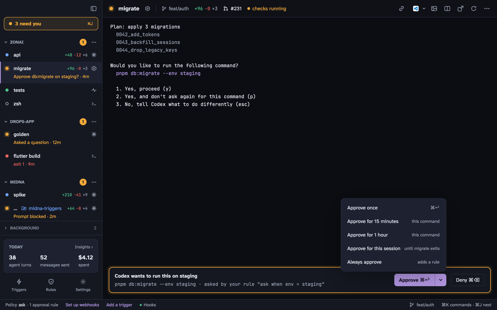

## Starting an agent

- <kbd>⇧</kbd> <kbd>⌘</kbd> <kbd>T</kbd> opens an agent in the current project, using the one you last used there (Claude Code by default).
- In <kbd>⌘</kbd> <kbd>K</kbd>, type a request and press <kbd>⇧</kbd> <kbd>↩</kbd> to start an agent with it as the first prompt.
- Typing `claude` or `codex` in a midna shell works too: midna picks it up as an agent terminal in place.
- Agents can start other agents: `midna open --agent claude --prompt "…"`.
- [Triggers](/docs/triggers/) can start agents from GitHub and Bitbucket events.

## What midna adds

When midna starts an agent, it passes everything on the command line. Your global Claude Code and Codex config isn't touched.

- **Claude Code** gets `--settings` with midna's hooks (turn start and end, tool calls, permission dialogs, and a [rules](/docs/rules/) check before each tool call), midna's status line for cost tracking, the [MCP server](/docs/cli/#mcp-server), and a two-line system prompt hint that it's running in midna.
- **Codex** gets `-c notify=…` so midna hears when a turn ends, plus the MCP server and the same hint.
- Every terminal gets `MIDNA_SESSION`, `MIDNA_PROJECT` and `MIDNA_SOCKET` in its environment and the `midna` CLI on its `PATH`.

If you'd rather have the hooks in your global config, the **Hooks** item in the status bar can install them in one click. They do nothing outside a midna terminal.

## Needs you

Anything only you can answer goes to **Needs you**. The terminal's row turns orange with a line saying why, the **N need you** button shows at the top of the sidebar, and midna can post a notification.

- The terminal you're looking at shows its approval along the bottom. <kbd>⌘</kbd> <kbd>↩</kbd> approves, <kbd>⌘</kbd> <kbd>⌫</kbd> denies.
- <kbd>⌘</kbd> <kbd>J</kbd> goes through everything waiting, one card at a time, oldest first.



| Item | What it is | <kbd>⌘</kbd> <kbd>↩</kbd> | <kbd>⌘</kbd> <kbd>⌫</kbd> |
| --- | --- | --- | --- |
| Approval | A rule said **ask**, or an agent asked for a human-only action | Approve | Deny |
| Permission prompt | Claude Code or Codex is showing its own permission dialog | Approve | Deny |
| Blocked | An agent can't continue without you (`midna attention`) | I've done it | Dismiss |
| Failed | A monitor or agent exited with an error | Restart | Dismiss |
| Rule removal | An agent asked you to remove a rule | Remove | Keep |
| Trigger | A trigger needs its secret, or is waiting to start | Open / Start | Dismiss / Deny |

Answering a permission prompt from midna presses the key in the agent's dialog for you, after midna has seen the dialog on screen.

### Approving for longer

The arrow next to **Approve** has longer options. Each adds an **allow** [rule](/docs/rules/) for exactly what was asked:



| Option | Rule it adds |
| --- | --- |
| Once | None |
| 15 minutes, 1 hour | An expiring rule for this terminal |
| This session | A rule for this terminal |
| Always | A rule for the whole project |

### Human-only requests

When an agent calls something only you may do, like removing a rule or enabling a trigger, the card shows the exact call that approving will run. If what it points at has changed before you answer, approving fails rather than running the new version.

Agents can't approve requests unless you turn on `approve.from_cli`, and even then only their own terminal's, never a human-only action. An agent blocked on an approval waits up to 5 minutes (`policy.request_timeout_secs`).

## Long sessions

- **Prompt history.** Claude Code and Codex draw their own screen, so their conversation isn't in the scrollback. <kbd>⌥</kbd> <kbd>⌘</kbd> <kbd>↑</kbd> / <kbd>↓</kbd> scrolls the agent's view to your previous or next prompt, and <kbd>⌘</kbd> <kbd>P</kbd> lists them to jump to.
- **Queued messages.** Queue a follow-up and midna types it once the agent is ready: idle, not waiting on you, nothing in its input box. A message can also wait for a time or for another terminal to finish (`midna queue add --after <id> "…"`).
- **Images.** <kbd>⌘</kbd> <kbd>I</kbd>, or pasting a screenshot, attaches images to the next message. Click to drop numbered pins or drag to mark an area, with a note for each.
- **Session links.** <kbd>⌘</kbd> <kbd>L</kbd> lists the URLs, pull requests and files that came up in the conversation.
- **Restart into the same conversation.** The restart button (or `midna restart <id>`) reopens the agent with `claude --resume` / `codex resume`. When a newer Claude Code is installed, midna restarts idle terminals into the same conversation (`agents.restart_on_update`).

## Cost and Insights

Claude Code's spend comes from midna's status line and shows per turn. Codex doesn't report cost. **Insights** (<kbd>⇧</kbd> <kbd>⌘</kbd> <kbd>I</kbd>) charts turns, messages, spend, approvals, and how long each agent worked versus waited on you, by day, week or month, with an activity log you can filter.

```bash
midna insights --range week --by project
```
