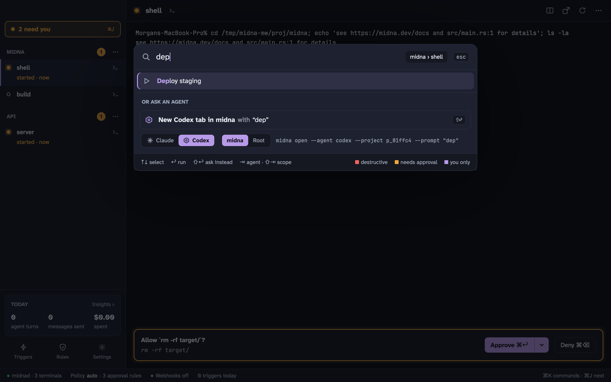

## Open a terminal

You don't need a project to start. Press <kbd>⌘</kbd> <kbd>T</kbd> and you get a shell at **root**, which starts in your home folder. Root terminals sit at the top of the sidebar, without a heading.

## Open a project

A project is a folder that groups terminals. Press <kbd>⌘</kbd> <kbd>O</kbd> and pick a folder. Midna adds it to the sidebar and opens a shell in it. From then on, <kbd>⌘</kbd> <kbd>T</kbd> opens new terminals in the current project, and <kbd>⌘</kbd> <kbd>1</kbd>–<kbd>9</kbd> jumps between projects.

If your projects live in a few folders, like `~/Development`, add them as **project folders**: choose **Add project folder…** on the empty screen or in <kbd>⌘</kbd> <kbd>K</kbd>. Their subfolders then show up when you search <kbd>⌘</kbd> <kbd>K</kbd>, ready to open. You can also type a path like `~/Development/api` straight into <kbd>⌘</kbd> <kbd>K</kbd>.

A project leaves the sidebar when you close its last terminal, but midna remembers it. Its rules and saved commands are still there when you open it again, and it shows under **Recent**.

## Start an agent

Press <kbd>⇧</kbd> <kbd>⌘</kbd> <kbd>T</kbd> for a new agent terminal in the current project. Midna starts the agent you used last in that project, Claude Code by default.

Or ask for something in plain words. Press <kbd>⌘</kbd> <kbd>K</kbd>, type what you want ("summarize the failing tests"), and press <kbd>↩</kbd> when nothing else matches, or <kbd>⇧</kbd> <kbd>↩</kbd> any time. Midna opens a new agent terminal with your text as its first prompt. <kbd>⇥</kbd> switches between Claude and Codex, and <kbd>⇧</kbd> <kbd>⇥</kbd> between this project and root.

Midna launches the agent with its own hooks and MCP server, so the sidebar shows when it's working, done or waiting on you. Your global Claude and Codex config isn't touched. See [Claude Code and Codex](/docs/agents/).

## Answer what it asks

When an agent needs you, its sidebar row gets an orange dot and a line saying why, and the **N need you** button appears at the top of the sidebar.

- If the terminal you're looking at is waiting on an approval, a banner shows at the bottom of it. Press <kbd>⌘</kbd> <kbd>↩</kbd> to approve once, or <kbd>⌘</kbd> <kbd>⌫</kbd> to deny. The arrow next to **Approve** has longer options, like 15 minutes or always.
- Press <kbd>⌘</kbd> <kbd>J</kbd> to go through everything that's waiting, one card at a time.

See [Needs you](/docs/needs-you/) for every kind of item and what approving does.

## Find anything with ⌘K

<kbd>⌘</kbd> <kbd>K</kbd> is the command bar. Start typing to:

- go to a terminal or project
- open a new terminal or agent, here or at root
- run a project's saved commands
- answer a needs-you item
- open Rules, Triggers, Insights or Settings
- switch the theme or density
- restart, pop out or close a terminal

Commands that destroy something, like closing a terminal, need <kbd>↩</kbd> twice: the first press shows what will happen. <kbd>esc</kbd> closes the bar.

## Next

- [Projects and terminals](/docs/projects-and-terminals/): splits, pop-outs, find, links and more
- [Rules](/docs/rules/): decide what agents may do without asking
- [Keyboard shortcuts](/docs/shortcuts/)
