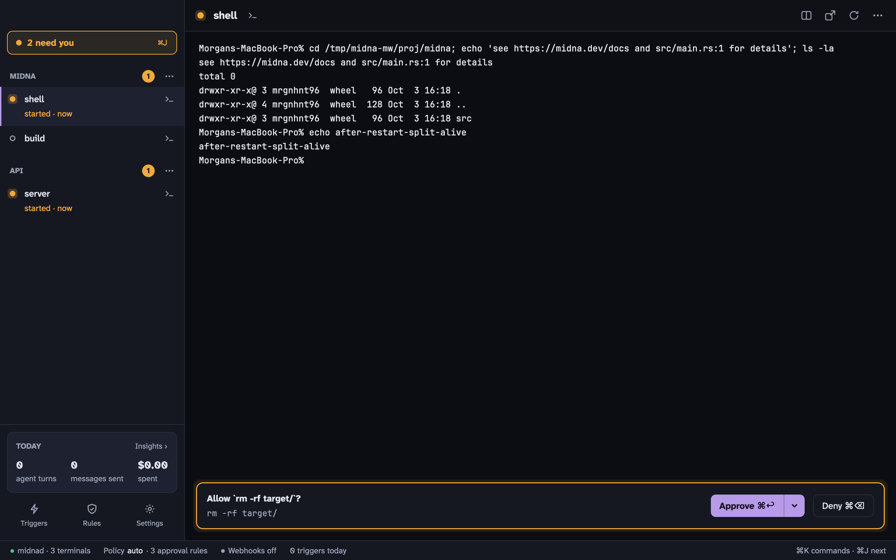

Midna is a terminal for macOS built for working with AI agents like Claude Code and Codex. You open projects and terminals as you would in any terminal. The difference is that agents can drive midna too: they can open terminals you can watch, read other terminals, add rules and draft webhook triggers. The few things that should stay yours (approving, removing rules, setting secrets) come to you as **Needs you** items.

## How it fits together

**A daemon owns your terminals.** A background process called `midnad` runs every shell, along with your projects, rules, triggers and settings. The Midna app is a window onto it. Quitting the app, restarting it or updating it never kills a shell. When you open midna again, your terminals are where you left them.

**Projects group terminals.** A project is a folder. Each terminal in it runs one of three things:

- a **shell**, like any terminal
- a **monitor**, a long-running command you want to keep an eye on. If it fails, it tells you.
- an **agent**, Claude Code or Codex, started by midna so it can report its status, ask for approvals and track cost

**Agents may add, humans may remove.** Agents control midna through the [`midna` CLI](/docs/cli/) or its [MCP server](/docs/mcp/). They can open terminals, add rules, draft triggers and change most settings. Only you can approve a request, remove a rule, paste a webhook secret, switch a trigger on or change a human-only setting. When an agent asks for one of those, nothing happens until you answer.

**Needs you is your inbox.** Anything waiting on you shows up there: an approval, an agent's permission prompt, an agent that's blocked, a monitor that failed, a rule an agent wants removed. Press <kbd>⌘</kbd> <kbd>J</kbd> to go through them. See [Needs you](/docs/needs-you/).

**Everything is logged.** Every change and every call that acts is written to an event log. [Insights](/docs/insights/) draws its charts from it, and `midna events` shows it raw.

## Where to start

- New here? [Install midna](/docs/install/), then take your [first steps](/docs/first-steps/).
- Using agents? Read [Claude Code and Codex in midna](/docs/agents/) and [Rules](/docs/rules/).
- Want GitHub or Bitbucket events to start agents? See [Triggers and webhooks](/docs/triggers/).
- Wondering what an agent can and can't do? Read the [security model](/docs/security/).
- Something not working? See [Troubleshooting](/docs/troubleshooting/).
