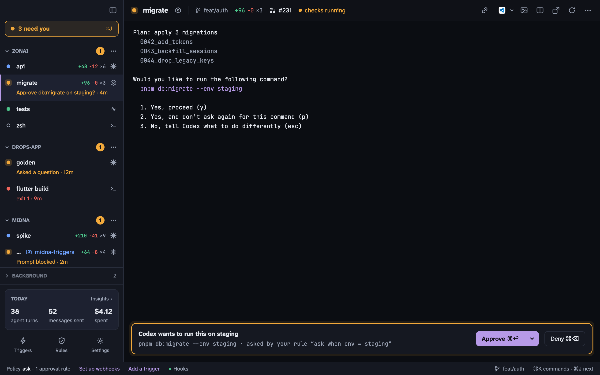

midna is a macOS terminal for working with AI agents like Claude Code and Codex. You use it like any terminal: projects in a sidebar, tabs, splits. Agents can use it too. Through the `midna` CLI or its MCP server they can open terminals you can watch, read other terminals, add rules and draft triggers. The few decisions that stay yours, like approving a request or removing a rule, come to you in one queue called **Needs you**.

## How it fits together

**A daemon owns your terminals.** `midnad` runs in the background and holds every shell, along with your projects, rules, triggers and settings. The Midna app is a window onto it, so quitting, relaunching or updating the app never kills a shell.

**Projects group terminals.** A project is a folder. Each terminal in it is one of:

- a **shell**
- a **monitor**: a long-running command such as a dev server or test watcher. If it exits with an error, it tells you.
- an **agent**: Claude Code or Codex, with its status, approvals and cost tracked by midna

**Agents may add; you remove.** Agents can open terminals, add rules, draft triggers and change most settings. Approving requests, removing rules, setting webhook secrets, switching triggers on and changing human-only settings are yours. When an agent tries one of those, it becomes a Needs you item and nothing happens until you answer. See the [security model](/docs/security/) for what this does and doesn't protect against.

**Everything is logged.** Every change is written to an event log. `midna events --follow` streams it, and **Insights** (<kbd>⇧</kbd> <kbd>⌘</kbd> <kbd>I</kbd>) charts agent turns, messages, spend and time spent waiting on you.

## Quick start

1. [Install midna](/docs/install/) and open it.
2. Press <kbd>⌘</kbd> <kbd>O</kbd> and pick a project folder. midna opens a shell in it.
3. Press <kbd>⇧</kbd> <kbd>⌘</kbd> <kbd>T</kbd> to start an agent there (Claude Code by default), or press <kbd>⌘</kbd> <kbd>K</kbd>, type what you want done and press <kbd>⇧</kbd> <kbd>↩</kbd>.
4. When the agent needs you, its row in the sidebar turns orange. Press <kbd>⌘</kbd> <kbd>↩</kbd> to approve or <kbd>⌘</kbd> <kbd>⌫</kbd> to deny, or <kbd>⌘</kbd> <kbd>J</kbd> to go through everything that's waiting.

## Next

- [Terminals and projects](/docs/terminals/): splits, find, links, the command bar
- [Agents and approvals](/docs/agents/): how midna runs Claude Code and Codex
- [Rules](/docs/rules/): what agents may do without asking
- [CLI and MCP](/docs/cli/): driving midna from an agent or a script
