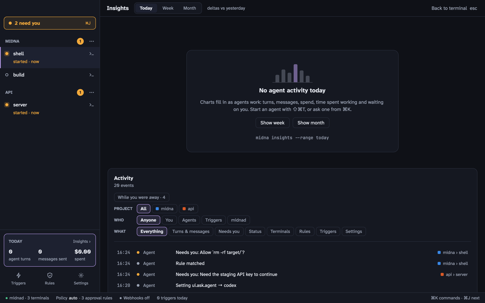

Insights charts what your agents did. Everything in it is computed from midna's event log, so it only shows what really happened.



Open it from the **Today** card at the bottom of the sidebar, from <kbd>⌘</kbd> <kbd>K</kbd>, or with <kbd>⇧</kbd> <kbd>⌘</kbd> <kbd>I</kbd>. <kbd>esc</kbd> goes back to the terminal.

## What it shows

Pick **Today**, **Week** or **Month** at the top. Each headline number compares with the period before.

- **Agent turns**: how many times an agent worked on something, stacked by project. Hourly for today, daily for a week or month. Hover a column for exact numbers, and click a project to filter the log.
- **Messages**: prompts you sent agents.
- **Spend**: Claude Code's cost, from the status line midna gives it. Codex doesn't report cost.
- **Working vs waiting on you**: per agent terminal, how long it worked and how long it sat waiting for you.
- **Approvals** and **triggers fired**.

The sidebar's **Today** card shows today's turns, messages and spend at a glance.

## Activity

Below the charts is the activity log for the range. Filter it by project, by who acted (**You**, **Agents**, **Triggers**, **midnad**) and by what happened (turns and messages, needs you, status, terminals, rules, triggers, settings). **While you were away** shows only what happened while midna wasn't in front. Click a row from a terminal that's still open to go to it.

## From the CLI

```bash
midna insights --range week --by project
midna insights series spend --range month
midna insights activity --limit 50
```
