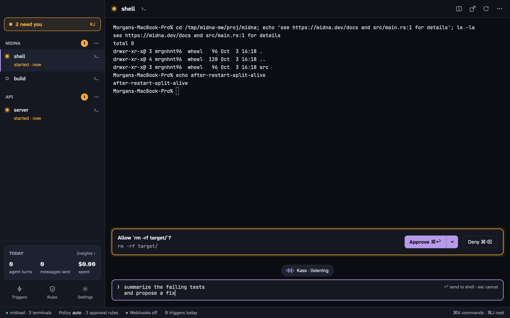

[Kass](https://kass.mrgnhnt.com) is a private dictation app for Apple Silicon Macs. Midna works with it: when you dictate into a midna terminal, the text lands in a **composer** under the terminal, where you can read and fix it before it's sent.

## How it works

1. Select a terminal in midna and start dictating with your Kass chord.
2. Kass tells midna it's about to type. Midna opens the composer under the terminal, with a **Kass · listening** pill, and puts the cursor in it.
3. When you stop, Kass inserts the cleaned-up text into the composer.
4. Read it over, edit if you like, and press <kbd>↩</kbd> to send it to the terminal. <kbd>esc</kbd> throws it away.

If an agent is running in the terminal, the whole text arrives as one message, even across several lines. <kbd>⇧</kbd> <kbd>↩</kbd> adds a new line in the composer.

To skip the review step, turn on `kass.auto_send` in **Settings › Agents**. The text is then sent as soon as Kass finishes, unless the dictation was cancelled or failed.

The composer only opens when midna's main window is in front showing a terminal, with nothing on top of it (no <kbd>⌘</kbd> <kbd>K</kbd>, Needs you, Rules, Triggers or Insights). Otherwise Kass types the way it does in any other app.

## Setting it up

You need a version of Kass that supports the dictation handshake. There's nothing to turn on in midna. **Settings › Agents › Kass** says **Handshake detected** once Kass has talked to midna.

Kass needs its usual permissions to type for you. Midna's own Accessibility permission is optional; read [the note on the security page](/docs/security/#accessibility-and-processes-in-your-terminals) before you grant it.

## Typing long prompts by hand

The composer isn't only for dictation. Press <kbd>⇧</kbd> <kbd>⌘</kbd> <kbd>D</kbd> to open it under the selected terminal and type or paste a long prompt with normal Mac text editing, then <kbd>↩</kbd> to send.
