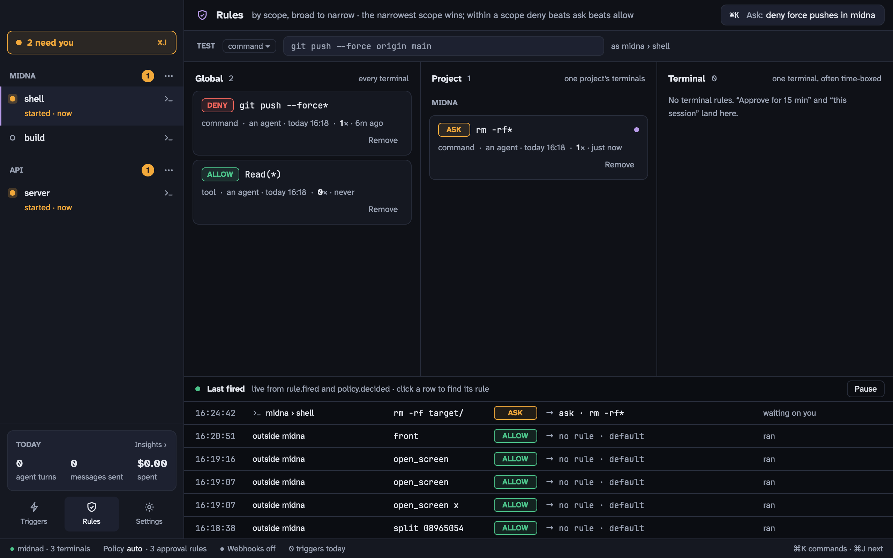

Rules decide whether an agent's action is **allowed**, needs **asking**, or is **denied**. Agents can add rules; only you can remove them.



Open Rules from the sidebar, from <kbd>⌘</kbd> <kbd>K</kbd>, or with <kbd>⇧</kbd> <kbd>⌘</kbd> <kbd>R</kbd>.

## What a rule is

A rule has an **effect** (allow, ask, deny), a **kind**, a **pattern** and a **scope**.

| Kind | Matches | Example pattern |
| --- | --- | --- |
| `tool` | Claude Code tool calls, as `Tool(argument)` | `Bash(rm -rf*)`, `Edit(/etc/*)` |
| `command` | A command line | `git push --force*` |
| `path` | A file path | `~/.ssh/*` |
| `cli` | An agent's own `midna` commands | `close --force*` |
| `window` | An agent acting on a window | `split*` |

Patterns are globs over the whole value: `*` matches anything, `?` one character, `\` escapes.

Scopes are **global** (every terminal), **project**, or **terminal**. A rule can expire; the ones made by approving "for 15 minutes" do.

Claude Code checks every tool call against your rules through the hooks midna starts it with. Codex has no hook before tool calls, so rules don't gate them; Codex's own prompts still show up in Needs you.

## Which rule wins

1. The narrowest scope with a matching rule wins: terminal, then project, then global.
2. Within a scope, **deny** beats **ask**, which beats **allow**. An allow you created by approving **Always** beats an ask in the same scope, so you aren't asked again.
3. If nothing matches, `policy.default` decides. Its default, `auto`, asks before an agent's destructive `midna` commands (`close --force`, `restart`, `project remove`, `rules remove`, `settings reset`), allows everything else, and leaves Claude Code tool calls to Claude's own permission settings.

## Testing an action

The **Test** field at the top checks an action as the current terminal without running it, and shows the rule that decided and why the others didn't match. From a shell:

```bash
midna check command -- git push --force origin main
midna explain command -- git push --force origin main
```

The **Last fired** feed at the bottom shows each decision live, with the rule that made it.

## Adding rules

Most rules come from approving with a duration ([Approving for longer](/docs/agents/#approving-for-longer)) or from asking an agent ("deny force pushes in this project"). From the CLI:

```bash
midna rules add deny command 'git push --force*'
midna rules add ask tool 'Bash(rm -rf*)' --scope project:p_1a2b3c
midna rules add allow tool 'Bash(npm test*)' --scope session:ab12cd34 --expires 3600
```

## Removing rules

Click **Remove** on a rule and confirm. For ten seconds you can **Undo**.

Agents can't remove rules. An agent that thinks one is wrong asks:

```bash
midna rules request-removal r_9f8e7d --reason "blocks the release script"
```

That becomes a Needs you item with **Remove** and **Keep**. The rule stays in force until you choose.
