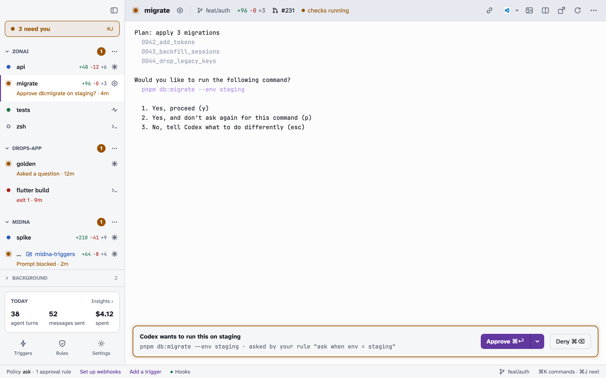

Settings live in the daemon, not in a file. The Settings window, the CLI and agents all change the same values, and changes show up everywhere at once.

## Changing settings

Open **Settings** with <kbd>⌘</kbd> <kbd>,</kbd>. Each row shows the control, the CLI command that does the same thing, and who can change it: **human only**, **agents too**, or read-only. The **Ask** box at the top hands a request to an agent, like "make ⌘T open Claude at the project root".

```bash
midna settings list            # every key with its value, default and description
midna settings get theme
midna settings set theme light
midna settings reset theme
midna explain policy.default   # what one setting does
```

Values are JSON or bare words (`true`, `42`, `dark`). Human-only settings can be read by anyone, but setting one from a terminal raises a Needs you request instead.

## Themes

midna has eight built-in themes: **Midna Twilight**, **Nord**, **Dracula**, **Gruvbox** and **Tokyo Night** (dark), and **Daylight**, **Solarized Light** and **Catppuccin Latte** (light). A theme sets the app's colors and the terminal's 16 ANSI colors.



```bash
midna themes                     # list themes
midna themes use nord            # pick one
midna settings set theme system  # follow macOS, using theme.dark and theme.light
```

**Custom themes** are JSON files in `~/Library/Application Support/com.mrgnhnt.midna/themes/`. A theme can `extend` another and only list the colors it changes. `midna themes format` prints the file shape. Edits show up live. To change one color on top of any theme, use `theme.colors`:

```bash
midna settings set theme.colors "accent = #FF79C6"
```

## Settings worth knowing

| Key | Default | What it does |
| --- | --- | --- |
| `policy.default` | `auto` | Human only. The decision when no [rule](/docs/rules/) matches. |
| `approve.from_cli` | `false` | Human only. Agents may approve their own terminal's requests. |
| `agents.may_move_windows` | `false` | Human only. Agents may move, pop out or close windows. |
| `agents.mcp` | `true` | Give agents midna starts the [MCP server](/docs/cli/#mcp-server). |
| `agents.restart_on_update` | `when_idle` | Restart Claude terminals into the same conversation after a Claude Code update: `when_idle`, `ask` or `off`. |
| `ui.ask.agent` | `claude` | The agent that ⌘K's "ask an agent" starts. |
| `projects.roots` | none | Folders your projects live in, offered in ⌘K. |
| `ide.app` | `auto` | The editor the header's editor button opens. `ide.rules` overrides it per folder or file type. |
| `terminal.option_as_meta` | `true` | <kbd>⌥</kbd> acts as Meta. |
| `kass.auto_send` | `false` | Send Kass dictations without review. |
| `updates.channel` | `stable` | `stable` or `beta`. |
| `webhooks.path` | `off` | Human only. `tailscale_funnel` to receive webhooks. |
| `triggers.agent_mode` | `supervised` | Human only. How agents started by webhook triggers run. |

## Layout

The header, the sidebar rows and the status bar are all configurable.

- `ui.header.script` (default `github`) and `ui.row.script` (default `diff`) are built-in parts joined with `+`: `worktree` (an icon; the name shows on hover), `branch`, `sync`, `diff`, `files`, `pr`, `agent`. Or `none`, or a path to your own script.
- `ui.header.buttons` orders the header buttons; built-ins left out move into the **…** menu. A path to a script adds your own button.
- `ui.status.items` lists the status bar items. Right-click the status bar or header to toggle items.
- `ui.status.looks` restyles built-in statuses: `needs_you = pink icon:bell label:Your turn`.

`midna explain scripts` describes the script output format.

## Notifications

midna records what you'd want to know: an approval or question, a blocked agent, a failure, a long turn finishing (`notify.turn_done`, after 30 seconds), and notifications agents and triggers send. Others, like PR checks finishing and trigger firings, are off by default. Out of the box only what needs you (approvals, questions and blocked agents) becomes a macOS banner, and only for a terminal you aren't looking at; for the one in front of you, you hear its sound. Each kind's `notify.push.<kind>` turns banners on for other terminals, and `notify.push_focused.<kind>` for the one you're looking at. The bell at the far left of the status bar opens the Notifications screen: everything midna recorded, banner or not, with how many are unread; opening it marks them all read. While midna is in front, a banner shows as a card inside the window instead of a macOS banner. `notify.enabled` turns everything off. Each kind has its own switch, sound and volume under `notify.*`, and a single terminal can be muted from its header's **…** menu.

## Keyboard shortcuts

Every `keys.*` setting is a shortcut. See [Keyboard shortcuts](/docs/shortcuts/).

## Resetting

**Settings › Danger zone** has **Reset settings**, which puts every setting back to its default, and **Reset midna**, which also closes every terminal and removes projects, triggers and Needs you items. Rules and the event log are kept either way.
