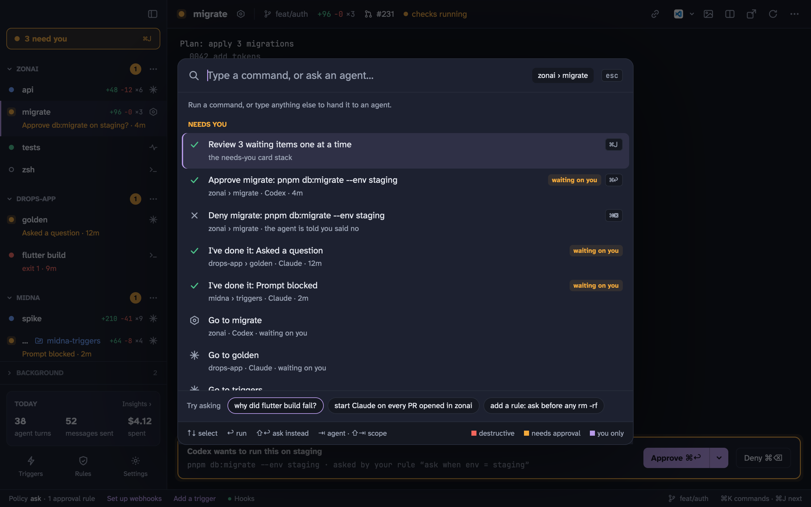
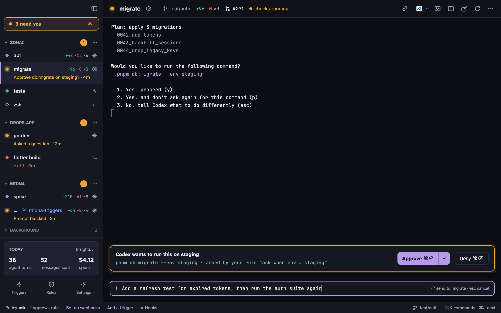

## Projects

A project is a folder. Press <kbd>⌘</kbd> <kbd>O</kbd> to open one; midna adds it to the sidebar with a shell in it. <kbd>⌘</kbd> <kbd>T</kbd> then opens new terminals in the current project, and <kbd>⌘</kbd> <kbd>1</kbd>–<kbd>9</kbd> switches projects. <kbd>⌥</kbd> <kbd>⌘</kbd> <kbd>T</kbd> opens a terminal outside any project, in your home folder.

If your projects live under a few folders like `~/Development`, set them as `projects.roots`. Their subfolders then show up in <kbd>⌘</kbd> <kbd>K</kbd>, ready to open.

A project leaves the sidebar when its last terminal closes, but its rules and saved commands are kept for next time.

## Kinds of terminal

- **Shell**: your login shell.
- **Monitor**: a long-running command you want to keep an eye on. If it exits with an error, it raises a **failed** item in Needs you with the last lines of output and a **Restart** button. A project's saved commands run as monitors (`midna projects add-command`).
- **Agent**: Claude Code or Codex. See [Agents and approvals](/docs/agents/).

Each terminal's dot in the sidebar shows its status:

| Status | Meaning |
| --- | --- |
| idle | Waiting for input |
| working | An agent turn or a command is running |
| needs you | Waiting on an approval, a permission prompt or a question |
| done | An agent finished its turn and you haven't looked yet |
| failed | The process exited with an error |
| exited | The process exited cleanly |

`midna explain <terminal-id>` says why a terminal has the status it has.

The header shows the branch, the diff against it and the pull request's checks. What it shows, and what the sidebar rows and status bar show, is configurable; see [Settings](/docs/settings/#layout).

## Terminals survive restarts

Terminals run in `midnad`, not in the app. Quitting, relaunching or [updating](/docs/install/#updates) midna keeps every shell running with its screen and scrollback. While the daemon restarts, the status bar says **midnad restarting…** and the panes reconnect on their own. If the daemon is killed outright or crashes, its terminals are lost and show as exited.

## The command bar

<kbd>⌘</kbd> <kbd>K</kbd> opens the command bar. Type to go to a terminal or project, answer a waiting item, run a saved command, open Rules, Triggers, Insights or Settings, or switch the theme.

To start an agent, type what you want done and press <kbd>⇧</kbd> <kbd>↩</kbd> (or <kbd>↩</kbd> when nothing else matches). <kbd>⇥</kbd> switches between Claude and Codex, and <kbd>⇧</kbd> <kbd>⇥</kbd> between this project and your home folder.

Commands that destroy something, like closing a busy terminal, need <kbd>↩</kbd> twice.

## Working in a terminal

- **Scrollback.** Trackpad or wheel, <kbd>⇧</kbd> <kbd>Page Up</kbd> / <kbd>Page Down</kbd>, or <kbd>⌘</kbd> <kbd>↑</kbd> / <kbd>↓</kbd> for top and bottom.
- **Selection.** Drag, double-click for a word, triple-click for a line, <kbd>⌥</kbd>-drag for a rectangle.
- **Find.** <kbd>⌘</kbd> <kbd>F</kbd> searches the scrollback. <kbd>↩</kbd> goes to the next older match, <kbd>⇧</kbd> <kbd>↩</kbd> to the newer one. Case is ignored unless you type a capital.
- **Links.** <kbd>⌘</kbd>-click opens URLs and file paths like `src/main.rs:12:5`, which open in `$EDITOR` at that line.
- **Text editing.** <kbd>⌘</kbd> <kbd>←</kbd> / <kbd>→</kbd>, <kbd>⌥</kbd> <kbd>←</kbd> / <kbd>→</kbd>, <kbd>⌥</kbd> <kbd>⌫</kbd> and <kbd>⌘</kbd> <kbd>⌫</kbd> work as in a Mac text field, and <kbd>⇧</kbd> with them selects.
- **Option as Meta** is on by default (`terminal.option_as_meta`). Turn it off to type accented characters with <kbd>⌥</kbd>.
- **Open in your editor.** The editor button in the header opens the terminal's folder in Cursor, VS Code, Zed, a JetBrains IDE, Xcode and others midna finds installed (<kbd>⌥</kbd> <kbd>⌘</kbd> <kbd>E</kbd>). The one you pick is remembered per project.

## Splits and windows

- **Split.** <kbd>⌘</kbd> <kbd>D</kbd> opens a shell beside the current terminal. The pane's strip switches side by side or stacked, swaps it into the main pane, or closes the split. Closing a split never closes its terminal.
- **Pop out.** The pop-out button moves a terminal into its own window, which floats above other apps until you turn off **Keep on top**.
- **Rename.** Double-click the name in the header or sidebar.
- **Reorder.** Drag rows within a project.
- **Restart.** Reruns the terminal's command. For an agent, it reopens the same conversation.

<kbd>⌘</kbd> <kbd>W</kbd> closes the selected terminal and kills its process; if it's busy, press it again to confirm. <kbd>⌘</kbd> <kbd>Q</kbd> is hold to quit, and quitting never closes your terminals.

## Long prompts and dictation

<kbd>⇧</kbd> <kbd>⌘</kbd> <kbd>D</kbd> opens the **composer** under the terminal: a normal Mac text field for writing or pasting a long prompt. <kbd>↩</kbd> sends it as one message, <kbd>⇧</kbd> <kbd>↩</kbd> adds a line, <kbd>esc</kbd> cancels.

With [Kass](https://kass.mrgnhnt.com) dictation, the composer opens by itself when you start speaking into a midna terminal, so you can read and fix the text before it's sent. Turn on `kass.auto_send` to skip that review.
