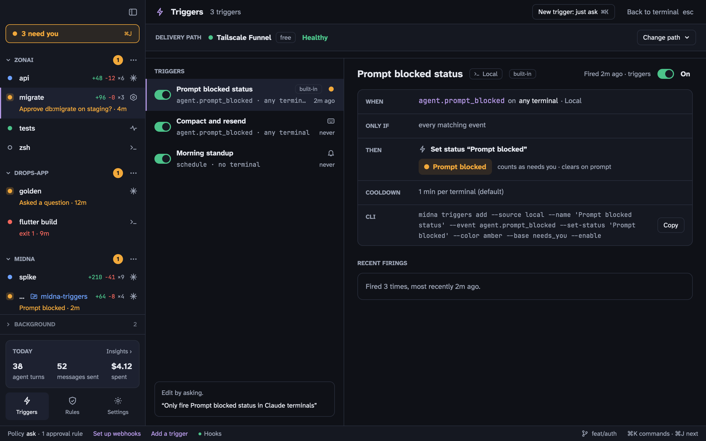

A trigger watches for an event and acts on it. There are two sources:

- **Webhooks** from GitHub or Bitbucket, such as a pull request being opened.
- **Local events** on your Mac: an agent's hook firing, a prompt being blocked, a terminal going idle, or a schedule.



Open Triggers from the sidebar, from <kbd>⌘</kbd> <kbd>K</kbd>, or with <kbd>⇧</kbd> <kbd>⌘</kbd> <kbd>G</kbd>. The easiest way to make one is to ask: click **New trigger: just ask** and describe it, and an agent drafts it with `midna triggers add`.

## Webhook triggers

A webhook trigger can **start an agent** with a prompt built from the event, **run a command** in a monitor terminal, or **raise attention** in Needs you.

### 1. Get webhooks to your Mac

midna receives webhooks through [Tailscale Funnel](https://tailscale.com/kb/1223/funnel), which gives your Mac a public HTTPS URL without opening ports on your router.

1. Install [Tailscale](https://tailscale.com/download/mac) and sign in.
2. In **Triggers**, click **Change path** and pick **Tailscale Funnel**. If Funnel isn't enabled for your tailnet, midna opens the Tailscale page to enable it.

midna forwards `https://<machine>.<tailnet>.ts.net:8443` to its local receiver on port 7787. The URLs to give GitHub and Bitbucket end in `/hooks/github` and `/hooks/bitbucket`; `midna webhooks status` prints them.

### 2. Create the trigger

```bash
midna triggers add --name "Review new PRs" --event pull_request.opened \
  --repo me/api --project p_1a2b3c \
  --agent claude --prompt 'Review PR #{{pr.number}}: {{pr.title}} {{pr.url}}'
```

- **Event**: GitHub `event` or `event.action` (`pull_request.opened`, `pull_request.*`), or a Bitbucket event key (`pullrequest:created`).
- **Filters**: `--repo`, `--branch`, `--action`, `--label`, each a case-insensitive glob.
- **Action**: `--agent claude|codex --prompt TEMPLATE`, `--run CMD`, or `--attention MSG`.
- **Templates**: `{{pr.number}}`, `{{pr.title}}`, `{{pr.url}}`, `{{repo}}`, `{{branch}}`, `{{sender}}`, or any payload path like `{{pull_request.head.ref}}`.

### 3. Set the secret and switch it on

Only you can do this step.

1. In the repository's **Settings › Webhooks**, add a webhook with the URL from step 1, content type `application/json`, a long random secret, and the events you want.
2. In midna, select the trigger, paste the same secret and save. It's stored in your Keychain and never shown again.
3. Switch the trigger on.

If an agent later changes what an enabled webhook trigger does, it goes back to draft until you switch it on again.

### Untrusted input

Webhook content comes from whoever opened the PR, so midna treats it as untrusted. Values from the payload are wrapped in `⟦ ⟧` in the prompt with a note that they're data, not instructions, and `--run` commands get every value shell-quoted. Agents started by a trigger run **supervised** by default: Claude Code with `--permission-mode default`, Codex with `on-request` approvals and a `workspace-write` sandbox, so their tool calls still come to you. This lowers the risk of prompt injection without removing it; keep agent triggers on repositories where you trust who can open PRs.

### Deliveries

Each trigger lists its recent deliveries as **verified**, **filtered**, **no trigger** or **bad signature**. A delivery never runs twice. **Replay** reruns a stored one, and `midna triggers test <id> --payload event.json` shows what a trigger would do without running it.

If your Mac was asleep, midna can fetch missed GitHub deliveries from the last 3 days with the [GitHub CLI](https://cli.github.com) (`midna webhooks reconcile`).

## Local triggers

Local triggers need no secret and act on the terminal that fired. Agents may add and enable them when you've asked for one.

| Event | Fires when |
| --- | --- |
| `hook.<Name>` | A Claude Code hook fires, like `hook.Stop` or `hook.PreCompact` |
| `agent.prompt_blocked`, `agent.turn_ended`, … | A midna event happens |
| `idle` | A terminal has had no prompt or turn for `--idle-for` |
| `schedule` | A cron time is reached (`--cron '0 9 * * mon-fri'`) |

Actions: type messages into the terminal (`--send`, each step waiting until the agent is ready), set a custom status with its own label and color (`--set-status`), post a notification (`--notify`), raise attention, or run a command.

```bash
# When a prompt is blocked for needing a compact, compact and send it again
midna triggers add --name "Auto-compact" --event agent.prompt_blocked \
  --match 'message=*Compact first*' --send /compact --send '{{last_prompt}}' --enable
```

`midna triggers add --help` and `midna explain triggers` have every flag.
