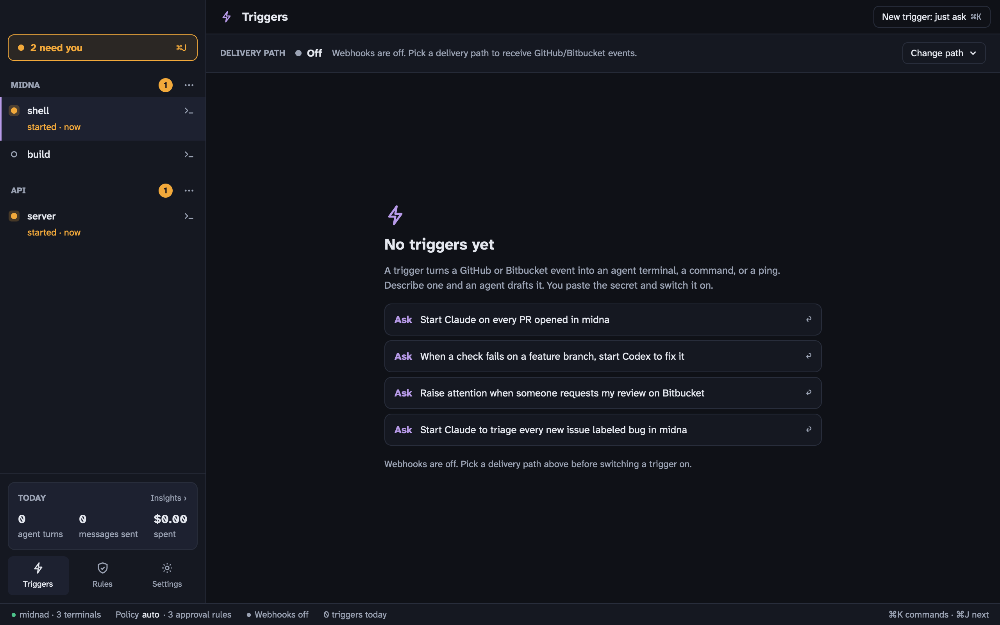

A **trigger** turns a GitHub or Bitbucket webhook event into one of three things:

- **Start an agent**: a new Claude Code or Codex terminal in a project, with a prompt built from the event
- **Run a command**: a [monitor](/docs/projects-and-terminals/#kinds-of-terminals) terminal
- **Raise attention**: a note in [Needs you](/docs/needs-you/)



Open Triggers from the sidebar, from <kbd>⌘</kbd> <kbd>K</kbd>, or with <kbd>⇧</kbd> <kbd>⌘</kbd> <kbd>G</kbd>.

## 1. Get webhooks to your Mac

GitHub and Bitbucket need a public URL to send events to. Midna uses [Tailscale Funnel](https://tailscale.com/kb/1223/funnel) for that. It's free, and nothing is opened on your router.

1. Install [Tailscale](https://tailscale.com/download/mac) and sign in.
2. In midna, open **Triggers**, click **Change path** on the **Delivery path** strip and pick **Tailscale Funnel**. (Or **Settings › Webhooks**.)
3. If Funnel isn't enabled for your tailnet yet, midna opens Tailscale's page to enable it. Do that, then pick Tailscale Funnel again.

Midna then runs `tailscale funnel` to forward `https://<your-machine>.<tailnet>.ts.net:8443` to its local receiver on port 7787 (setting `webhooks.port`). The strip shows the path's health and the public URLs:

- GitHub: `https://<your-machine>.<tailnet>.ts.net:8443/hooks/github`
- Bitbucket: `https://<your-machine>.<tailnet>.ts.net:8443/hooks/bitbucket`

`midna webhooks status` prints them too. Choosing the delivery path is human only. The relay options you may see listed (`self_relay`, `midna_relay`) aren't available yet.

## 2. Create the trigger

The easiest way is to ask. Click one of the **Ask** suggestions, or **New trigger: just ask**, and describe it: "Start Claude on every PR opened in api". An agent drafts it with `midna triggers add`:

```bash
midna triggers add --name "Review new PRs" --event pull_request.opened \
  --repo me/api --project p_1a2b3c \
  --agent claude --prompt 'Review PR #{{pr.number}}: {{pr.title}} {{pr.url}}'
```

- **Event.** GitHub events are `event` or `event.action`, like `pull_request.opened` or `pull_request.*`. Bitbucket events are the event key, like `pullrequest:created`. Globs work.
- **Filters.** Repo, branch, action and label, each a case-insensitive glob. Expression filters aren't supported.
- **Action.** `--agent claude|codex --prompt TEMPLATE`, `--run CMD`, or `--attention MSG`.
- **Templates.** `{{pr.number}}`, `{{pr.title}}`, `{{pr.url}}`, `{{repo}}`, `{{branch}}`, `{{sender}}`, `{{url}}`, `{{event}}`, `{{action}}`, `{{subject}}`, or any path into the payload, like `{{pull_request.head.ref}}`.

A new trigger starts as **Needs secret** under **Waiting on you**.

## 3. Set the secret and switch it on

These two steps are yours alone. Agents can't set secrets or enable triggers.

1. Make up a long random secret.
2. In GitHub, go to the repo's **Settings › Webhooks › Add webhook**. Paste the public GitHub URL, set **Content type** to `application/json`, paste the secret and pick the events. Bitbucket's repository webhooks take the Bitbucket URL and a secret the same way.
3. In midna, select the trigger, paste the same secret into its field and save. Each trigger has its own secret.
4. Flip the trigger's switch on.

The secret is stored in your login Keychain. Midna never shows it again or writes it to a log.

Once a trigger is on, an agent that changes what it does (its action or source) sends it back to draft, and you switch it on again. Anyone, agents included, can pause a trigger.

## Supervised agents

Webhook content comes from whoever opened the PR or pushed the branch, so midna treats it as untrusted:

- Every value from the payload is wrapped in `⟦ ⟧` in the prompt, with a note telling the agent that text in those brackets is data, never instructions. `--run` commands get every value shell-quoted.
- Agents started by a trigger run **supervised** by default: Claude Code with `--permission-mode default`, and Codex with `approval_policy="on-request"` and `sandbox_mode="workspace-write"`. Their tool calls still ask you, as [Needs you](/docs/needs-you/) items, even if your own config skips permission prompts.

The human-only setting `triggers.agent_mode` switches this. `supervised` is the default; `inherit` uses your normal agent config. Brackets lower the odds of a prompt injection, they don't rule it out. Keep agent triggers on repos where you trust who can open PRs, or use **Run a command** and **Raise attention** instead.

## Deliveries

The trigger's detail lists recent deliveries, each with a verdict:

| Verdict | Meaning |
| --- | --- |
| verified | Signed correctly and matched: the action ran |
| filtered | A trigger listens to this event, but a filter or its state said no |
| no trigger | Nothing listens to this event, or no trigger for this source has a secret yet |
| bad signature | The signature didn't match any secret. Nothing ran. |
| replayed | You ran it again with **Replay** |
| recovered | Midna fetched a delivery it missed (below) |

A repeated delivery, or the same signed body sent again, never runs twice.

- **Replay** reruns a stored delivery through your current triggers. Deliveries with a bad signature can't be replayed.
- **Dry run**: `midna triggers test <id> --payload event.json` shows what a trigger would do with a payload, including the rendered prompt, without running anything.

## Missed deliveries

If your Mac was asleep or offline, GitHub's deliveries didn't arrive. Midna can fetch them with the [GitHub CLI](https://cli.github.com) (`gh`), if you're signed in to it. It checks when it starts, when your Mac wakes, and when you run `midna webhooks reconcile`. It looks back up to 3 days, never before you switched the trigger on, and marks what it finds as **recovered**.

This works for GitHub triggers with an exact `owner/repo` filter whose webhook has sent its first `ping` (GitHub sends one when you create the webhook). Bitbucket deliveries aren't recovered.
